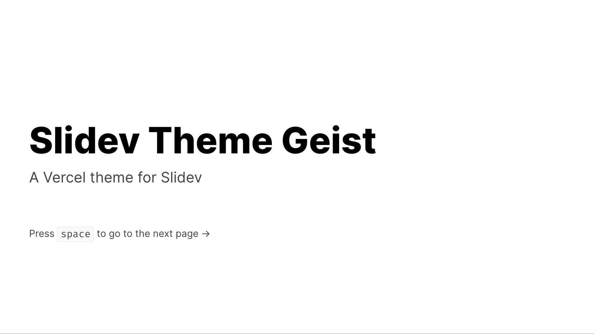
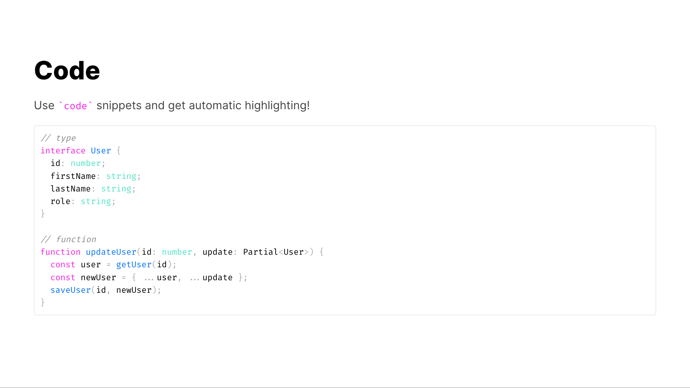

# Slidev Vercel Theme

[](https://www.npmjs.com/package/slidev-theme-geist)

Vercel theme for [Slidev](https://github.com/slidevjs/slidev). Based on [Vercel's design system](https://vercel.com/design)




Live demo: [slidev-theme-geist](https://slidev-theme-geist.vercel.app)

## Install

Add the following frontmatter to your `slides.md`. Start Slidev then it will prompt you to install the theme automatically.

```yml
---
theme: geist
---
```

Learn more about [using a theme](https://sli.dev/themes/use).

## Layouts

This theme provides the following layouts:

(will probably come in later releases)

## Components

This theme provides the following components:

(will probably come in later releases)

## Contributing

1. `npm install`
2. `npm run dev` to start the theme preview of `example.md`
3. Open `localhost:3030` to see the live demo
4. Edit `example.md` and style to see changes
5. `npm run export` to generate the preview PDF
6. `npm run screenshot` to generate the preview PNG
