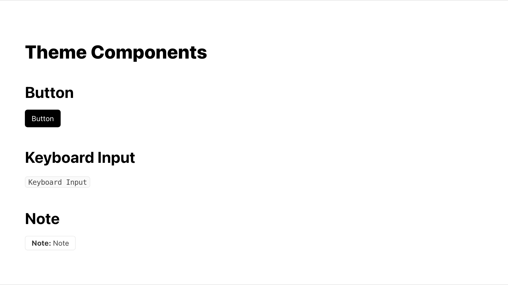

# slidev-theme-geist

Vercel theme for [Slidev](https://github.com/slidevjs/slidev). Based on [Vercel's design system](https://vercel.com/design)

Live demo: [slidev-theme-geist](https://slidev-theme-geist.vercel.app)

## Install

Add the following frontmatter to your `slides.md`. Start Slidev then it will prompt you to install the theme automatically.

<pre><code>---
theme: <b>geist</b>
---</code></pre>

Learn more about [how to use a theme](https://sli.dev/themes/use).

## Layouts

This theme provides the following layouts:

(will probably come in later releases)

## Components

This theme provides the following components:

(will probably come in later releases)

## Contributing

- `npm install`
- `npm run dev` to start theme preview of `example.md`
- Edit the `example.md` and style to see the changes
- `npm run export` to generate the preview PDF
- `npm run screenshot` to generate the preview PNG
